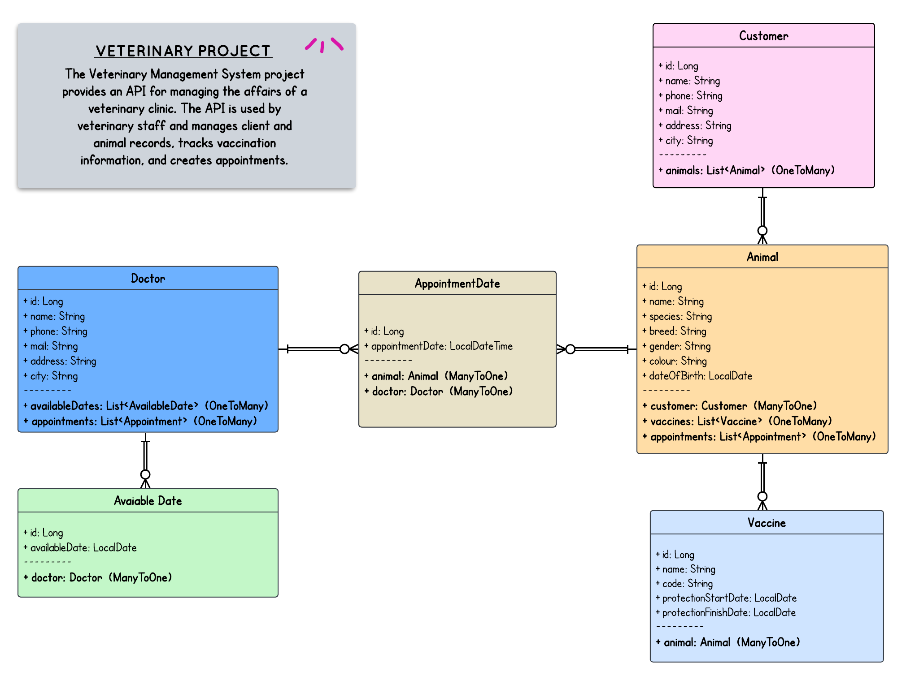

# Veterinary Management System

This project is an API developed to manage the business processes of a veterinary clinic. The system will be used by veterinary staff and includes doctor, customer, and animal management, vaccine records, and appointment tracking.

## Contents

- [Technologies Used](#technologies-used)
- [Project Architecture](#project-architecture)
- [Setup](#setup)
- [API Usage](#api-usage)
- [Database Schema](#database-schema)


## Technologies Used

- Java 
- Spring Boot
- Spring Data JPA
- Hibernate
- PostgreSQL
- ModelMapper
- Lombok
- Swagger

## Project Architecture

The project follows a layered architecture. The main package structure is as follows:

- `controller`: API endpoints
- `business`: Business logic
- `repository`: Database operations
- `dto`: Data Transfer Objects (Request and Response)
- `entities`: Database entities
- `core`: Utility classes and configurations

### UML Diagram




## Setup

1. Clone the project:

    ```sh
    git clone https://github.com/yourusername/veterinary-management-system.git
    cd veterinary-management-system
    ```

2. Install the necessary dependencies:

    ```sh
    mvn install
    ```

3. Configure the `application.properties` file with your database connection details:

    ```properties
    spring.datasource.url=jdbc:postgresql://localhost:5432/Vet_Cey
    spring.datasource.username=postgres
    spring.datasource.password=postgres
    spring.jpa.hibernate.ddl-auto=update
    ```

4. Run the application:

    ```sh
    mvn spring-boot:run
    ```

5. Load the sample data into the database (use the .sql file provided in the project folder).

## API Usage

### Customer Management

- **Add Customer**
    - Endpoint: `POST /api/customers`
    - Request Body:
      ```json
      {
          "name": "John Doe",
          "phone": "1234567890",
          "mail": "john@example.com",
          "address": "123 Main St",
          "city": "Anytown"
      }
      ```

- **Update Customer Information**
    - Endpoint: `PUT /api/customers/{id}`
    - Request Body: Same as above

- **View Customer Information**
    - Endpoint: `GET /api/customers/{id}`

- **Delete Customer**
    - Endpoint: `DELETE /api/customers/{id}`

### Animal Management

- **Add Animal**
    - Endpoint: `POST /api/animals`
    - Request Body:
      ```json
      {
          "name": "Buddy",
          "species": "Dog",
          "breed": "Labrador",
          "gender": "Male",
          "colour": "Yellow",
          "dateOfBirth": "2018-06-01",
          "customerId": 1
      }
      ```

- **Update Animal Information**
    - Endpoint: `PUT /api/animals/{id}`
    - Request Body: Same as above

- **View Animal Information**
    - Endpoint: `GET /api/animals/{id}`

- **Delete Animal**
    - Endpoint: `DELETE /api/animals/{id}`

### Vaccine Management

- **Add Vaccine**
    - Endpoint: `POST /api/vaccines`
    - Request Body:
      ```json
      {
          "name": "Rabies",
          "code": "RAB123",
          "protectionStartDate": "2023-01-01",
          "protectionFinishDate": "2024-01-01",
          "animalId": 1
      }
      ```

- **Update Vaccine Information**
    - Endpoint: `PUT /api/vaccines/{id}`
    - Request Body: Same as above

- **View Vaccine Information**
    - Endpoint: `GET /api/vaccines/{id}`

- **Delete Vaccine**
    - Endpoint: `DELETE /api/vaccines/{id}`

### Appointment Management

- **Add Appointment**
    - Endpoint: `POST /api/appointments`
    - Request Body:
      ```json
      {
          "appointmentDate": "2023-06-15T14:00:00",
          "doctorId": 1,
          "animalId": 1
      }
      ```

- **Update Appointment Information**
    - Endpoint: `PUT /api/appointments/{id}`
    - Request Body: Same as above

- **View Appointment Information**
    - Endpoint: `GET /api/appointments/{id}`

- **Delete Appointment**
    - Endpoint: `DELETE /api/appointments/{id}`

## Database Schema

The database schema includes the following tables:

- `customers`: Customer information
- `animals`: Animal information
- `vaccines`: Vaccine information
- `doctors`: Doctor information
- `available_dates`: Doctor availability dates
- `appointments`: Appointment information


